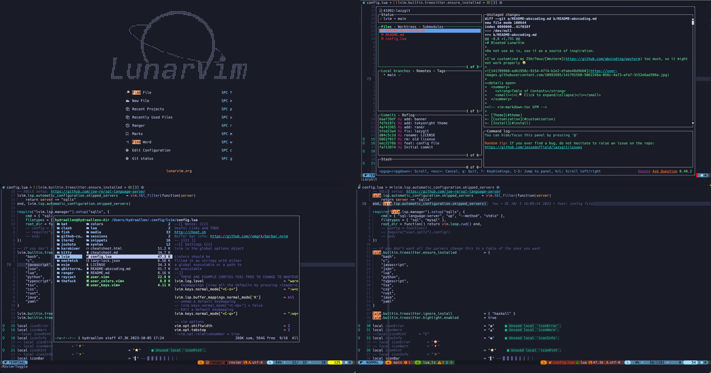
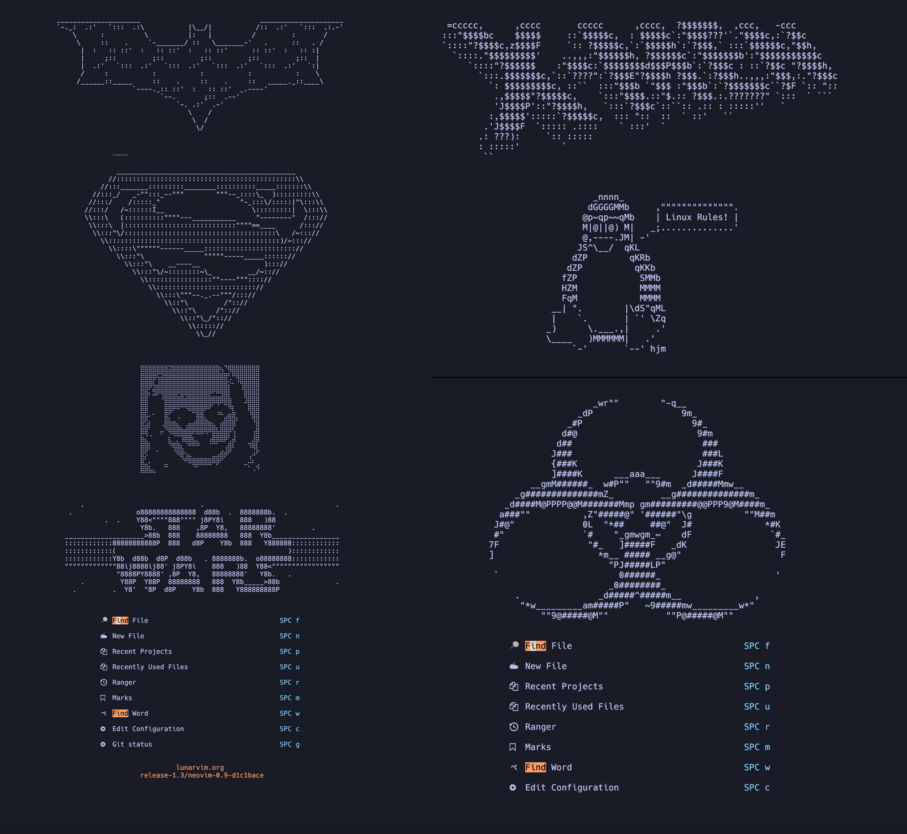
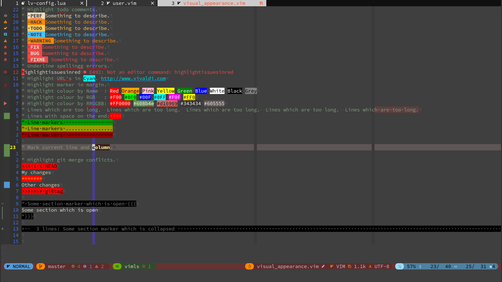
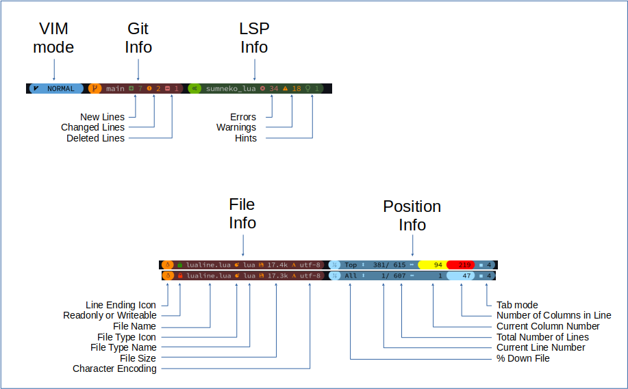
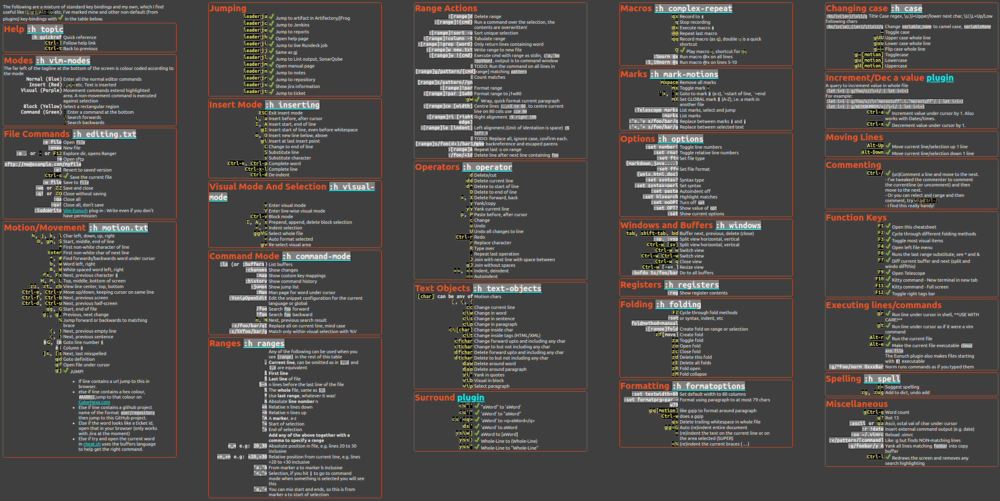

<!-- Shields -->
<!-- {{{1 -->


[](https://github.com/Hydraallenl/lvim/blob/master/LICENSE)
[](https://github.com/Hydraallen/lvim)

<!-- }}}1 -->

<!-- Main Image -->
<!-- {{{1 -->




<!-- }}}1 -->

<!-- Introduction -->
<!-- {{{1 -->

This is a set of config files based on [LunarVim](https://github.com/ChristianChiarulli/LunarVim) by [Christian Chiarulli](https://twitter.com/intent/follow?screen_name=chrisatmachine). I refered to [jimcornmell's config file](https://github.com/jimcornmell/lvim) and [abzcoding's config file](https://github.com/abzcoding/lvim).

Personally, I began using [vim](https://www.vim.org/) since 2022 September and started to use [neovim](https://neovim.io/) and [lunarvim](https://www.lunarvim.org/) at the beginning of 2023.


The main changes are documented below:

- Config for status line.
- Dashboard.
- Custom Keybindings.
- Custom Colours.
- and much more.


<!-- }}}1 -->

# Contents

<!-- {{{1 -->

- [Installation](#installation)
- [Visual Appearance](#visual-appearance)
- [Status Line](#status-line)
- [Extra Plugins](#extra-plugins)
- [Configured LSP's](#configures-lsp's)
- [Key Bindings](#key-bindings-cheatsheet)
- [Some Useful Links](#some-useful-links)

<!-- }}}1 -->

# Installation

<!-- {{{1 -->

- Follow the instructions on [Christian's site](https://github.com/ChristianChiarulli/LunarVim)
- Download this repo to `~/.config/lvim`

```bash
$ mv ~/.config/lvim ~/.config/lvim_backup
$ git clone https://github.com/abzcoding/lvim.git ~/.config/lvim
$ lvim +LvimUpdate +LvimCacheReset +q
$ lvim # run :Lazy sync
$ lvim # run :LspInstall sqlls
```

### Recommended Fonts

- [FiraCode]: My preferred nerd font
- Any of the [Nerd Fonts]

On macOS with Homebrew, choose one of the [Nerd Fonts],
for example, here are some popular fonts:

```shell
$ brew tap homebrew/cask-fonts
$ brew search nerd-font
$ brew install --cask font-fira-code-nerd-font
$ brew install --cask font-victor-mono-nerd-font
$ brew install --cask font-iosevka-nerd-font-mono
$ brew install --cask font-hack-nerd-font
```

<!-- }}}1 -->

# Visual Appearance

<!-- {{{1 -->



- I use [onedark](https://github.com/olimorris/onedarkpro.nvim) theme as I also used it for VSCode.

You can change it to zenburn or tokyonight by editing [`config.lua`](https://github.com/Hydraallen/lvim/blob/main/config.lua)

```lua
lvim.colorscheme                                  	= "zenburn"   -- https://github.com/jnurmine/Zenburn
lvim.colorscheme                                  	= "tokyonight"
lvim.colorscheme                                    = "onedark_vivid"   -- https://github.com/olimorris/onedarkpro.nvim
lvim.colorscheme                                    = "onedark"
lvim.colorscheme                                    = "onelight"
lvim.colorscheme                                    = "onedark_dark"
```

- The current cursor line is highlighted in light red
- The current cursor column is highlighted in light blue
- Whitespace at the end of a line in highlighted in bright red.
- Margin:
  - Current line number is highlighted in Yellow
  - Relative line numbers are shown in RoyalBlue
  - Markers are shown
  - Git changes are shown
  - Folding marks are also shown in the margin

  <!-- }}}1 -->

# Status line

<!-- {{{1 -->

The status line configuration can be found [here](https://github.com/Hydraallen/lvim/blob/main/lua/user/lualine.lua)


This image shows what is in the different sections.



The line is split into 5 main sections, 3 on the left and 2 on the right:

- On the left:
  - VIM Mode is colour coded, see the lualine.lua for details
  - Git information
  - LSP information
- On the right:
  - File information
    - Line Ending, Linux , Mac  or Windows 
    - File Name (red padlock when the file is readonly)
    - File Type
    - File Size
    - Character encoding
  - Position information - Percentage - Current Line Number / Number of lines in the file - Current column / length of current line - Tab mode,  or  and number of characters
  Note the column information is colour coded, >80 = Yellow >120 = Red.
  <!-- }}}1 -->

# Extra Plugins

<!-- {{{1 -->

I've added a few extra plugins I use to the configuration:

+ [Codeium](https://github.com/Exafunction/codeium.vim) "Free, ultrafast Copilot alternative for Vim and Neovim"
+ [Lazygit](https://github.com/kdheepak/lazygit.nvim) <kbd>F8</kbd> or `lg` to open.
+ [Ranger](https://github.com/kevinhwang91/rnvimr) `ra` to open.
+ [wakatime](https://wakatime.com/plugins) Record coding time for you.

- [Codi](https://github.com/metakirby5/codi.vim) I alias "bc" on the command line to get a powerful calculator scratchpad using python.
- [Colorizer](https://github.com/norcalli/nvim-colorizer.lua)
- [Dial](https://github.com/monaqa/dial.nvim) I've enabled a bunch of the predefined "increment's", also added a few of my own, e.g: True<->False and full month names, logging levels and more.  [See the config for details](lua/user/dial.lua)I
- [Fugitive](https://github.com/tpope/vim-fugitive) Git plugin from Tim Pope
- [Highlighturl](https://github.com/itchyny/vim-highlighturl) Highlight urls, jump to them with <kbd>g</kbd><kbd>j</kbd>
- [Markdown_preview](https://github.com/iamcco/markdown-preview.nvim) Open a markdown file and ":MarkdownPreview"
- [Todo comments](https://github.com/folke/todo-comments.nvim) With a few tweaks....
- [Vim Eunuch](https://github.com/tpope/vim-eunuch) Vim sugar for the UNIX shell commands that need it the most.  Also makes files starting with `#!` executable.
- [Vim Signature](https://github.com/kshenoy/vim-signature) A plugin to place, toggle and display marks.
- [Vim Surround](https://github.com/tpope/vim-surround) Surround.vim is all about "surroundings": parentheses, brackets, quotes, XML tags, and more. The plugin provides mappings to easily delete, change and add such surroundings in pairs.

<!-- }}}1 -->

# Configured LSP's

<!-- {{{1 -->

- [SQL](https://github.com/nanotee/sqls.nvim)

<!-- }}}1 -->

# Key Bindings-Cheatsheet

<!-- {{{1 -->

Note this cheatsheet is available as a HTML file, which is accessed by hitting <kbd>F1</kbd> in vim.
See my dotfiles for a simple bash script to convert this GitHut markdown file into HTML (and thus PNG).

- [Markdown Cheatsheet](cheatsheet.md)
- [HTML Cheatsheet](cheatsheet.html)
- [PNG Cheatsheet](./media/cheatsheet.png)



<!-- }}}1 -->

# Some Useful Links

<!-- {{{1 -->

|                             [](https://neovim.io)                             | [](https://github.com/ChristianChiarulli/LunarVim) |             [](http://vimsheet.com)             |
| :-------------------------------------------------------------------------------------------------------------------------------------: | :------------------------------------------------------------------------------------------------------------------: | :---------------------------------------------------------------------------------------------------------------: |
|           [](https://www.cheatsheet.wtf/vim/)           |  [](http://tnerual.eriogerg.free.fr/vimqrc.html)   |  [](https://paulgorman.org/technical/vim.html)  |
| [](https://catswhocode.com/vim-commands/) |         [](https://www.openvim.com/)         | [](http://www.oualline.com/vim-cook.html) |
|                      [](https://vimawesome.com)                       |                                                        &nbsp;                                                        |                                                      &nbsp;                                                       |

<!-- }}}1 -->


# Troubleshooting

1. Check your neovim version. Are you on the newest nightly version?
2. Reset your packer cache, and update lvim.
